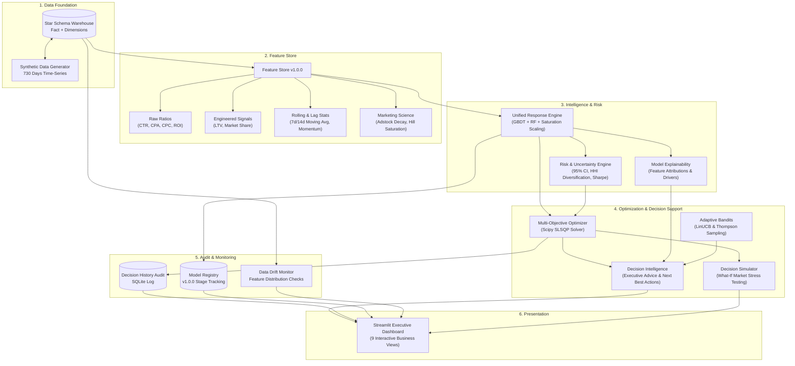

# Marketing Decision Intelligence & Optimization Platform

A modular software system and decision support pipeline that helps marketing managers allocate advertising budgets optimally across channels using machine learning, marketing mix dynamics, risk modeling, and constrained operations research.

---

## Overview

### 1. What the Project Does
The **Marketing Decision Intelligence & Optimization Platform** is an end-to-end decision system designed to answer a central business question:
> *"Given a marketing budget of \$X, how should capital be allocated across channels to maximize return, what is the risk/uncertainty profile, and how will performance shift under changing market conditions?"*

Rather than treating machine learning as an isolated prediction task, the platform embeds predictive models inside a layered decision pipeline that combines **Marketing Mix Modeling (MMM)**, **Operations Research (Constrained Optimization)**, **Sequential Online Learning (Contextual Multi-Armed Bandits)**, **Explainable AI (SHAP)**, and **MLOps tracking**.

### 2. Problem Addressed
Standard machine learning models output isolated point predictions (e.g., predicted revenue for a campaign) but fail to address real-world marketing constraints:
- **Advertising has memory and lag effects**: Prior spend builds brand equity that influences future conversion rates (Adstock effect).
- **Channels exhibit diminishing marginal returns**: Doubling spend on a saturated channel does not double revenue (Hill saturation curve).
- **Decisions require mathematical optimization**: Marketing managers operate under strict total budgets, channel floor/ceiling bounds, and target CPA limits.
- **Predictions have uncertainty**: Point estimates ignore variance, making risk evaluation impossible for financial planning.

### 3. Core Approach
The system structures decision intelligence into discrete, decoupled layers:
1. **Relational Data Foundation**: Kimball Star Schema modeling campaign performance facts and dimension tables.
2. **Central Feature Store**: Standardized feature computation ensuring training/inference consistency.
3. **Unified Response Model**: Gradient Boosted Trees and Random Forests calibrated with MMM saturation and adstock carryover.
4. **Risk Engine**: Uncertainty quantification, confidence intervals ($\mu \pm 1.96\sigma$), and diversification indices.
5. **Decision Optimization**: Multi-objective non-linear constrained optimization (Sequential Least Squares Programming - SLSQP).
6. **Adaptive Online Learning**: Contextual bandit algorithms (LinUCB and Thompson Sampling) balancing exploration of emerging platforms against exploitation of top performers.
7. **Decision History & MLOps**: SQLite-backed audit trails, experiment tracking, model registry, and data drift monitoring.
8. **Executive Presentation**: Streamlit dashboard organized around executive workflows.

---

## Key Features

- **Star Schema Data Warehouse**: Relational SQLite warehouse separating campaign facts (`Fact_Campaign_Performance`) from channel, customer, calendar, and competitor dimensions.
- **Multi-Layer Feature Store (`v1.0.0`)**: Automated computation of baseline ratios (CTR, CPA, CPC, CVR, ROI, RPC, RPI), customer LTV proxies, market share proxies, 7d/14d rolling momentum, and marketing science transformations.
- **Unified Campaign Response Function**: Mathematical mapping $f(\mathbf{B}, \mathbf{x}) \to (\text{Revenue}, \text{Conversions}, \text{CPA}, \sigma)$ unifying ML regression with non-linear saturation scaling.
- **Risk & Uncertainty Quantification**: Calculates prediction standard error, 95% confidence intervals, Herfindahl-Hirschman channel diversification scores, and a Marketing Sharpe Ratio ($\text{ROI} / (\text{CV} + 0.05)$).
- **Multi-Objective Constrained Optimizer**: Mathematical solver maximizing a composite utility of revenue and conversions while penalizing high CPA and forecast variance under explicit budget constraints.
- **Decision Simulator ("What-If" Analysis)**: Scenario engine modeling the impact of competitor CPC inflation, promotional holiday demand spikes, and budget scaling.
- **Contextual Multi-Armed Bandits**: Sequential online learning simulating daily budget adjustments using LinUCB (Ridge regression upper confidence bounds) and Gaussian Thompson Sampling.
- **Decision Intelligence & Explainability**: Translation of SHAP feature importance vectors into plain-language driver summaries and prioritized Next Best Actions.
- **Decision History Audit Trail**: Persistent logging of every optimization run (inputs, constraints, allocated vector, predicted metrics, and model version) for auditability.
- **MLOps Control Center**: Local model registry with stage transitions (`Production`, `Staging`, `Archived`), experiment tracking log, and automated distribution drift detection.

---

## System Architecture & Workflow



---

## Mathematical Formulations & Modeling Details

### 1. Marketing Mix Dynamics

#### Geometric Adstock Carryover (Memory Effect)
Advertising spend accumulates memory and decays over subsequent periods:
$$A_{c, t} = S_{c, t} + \lambda_c A_{c, t-1}$$
where:
- $S_{c, t}$ is the spend in channel $c$ on day $t$.
- $\lambda_c \in [0, 1)$ is the channel-specific decay parameter ($\lambda_{\text{TV}} = 0.70$, $\lambda_{\text{LinkedIn}} = 0.50$, $\lambda_{\text{Social}} = 0.40$, $\lambda_{\text{Email}} = 0.30$, $\lambda_{\text{Search}} = 0.20$).

#### Hill Saturation Transformation (Diminishing Marginal Returns)
Spend effectiveness saturates according to the Hill function:
$$S(A) = \frac{A^\gamma}{K^\gamma + A^\gamma}$$
where:
- $K = 2500$ is the half-saturation point.
- $\gamma = 0.85$ is the shape parameter controlling the curve slope.

### 2. Campaign Response Function
The unified response model combines base supervised machine learning predictions ($\hat{y}_{\text{ML}}$ from Gradient Boosted Trees for revenue and Random Forests for conversions) with marketing science saturation scaling:
$$\text{Revenue}_{\text{adjusted}}(B_c, \mathbf{x}) = \hat{y}_{\text{ML}}(B_c, \mathbf{x}) \times \left(0.50 + 0.50 \times S(A_c)\right)$$

### 3. Multi-Objective Constrained Optimization
The optimization problem is formulated as non-linear continuous mathematical programming solved via Sequential Least Squares Programming (SLSQP):

$$\max_{\mathbf{B}} \quad U(\mathbf{B}) = w_1 \left(\frac{\text{Rev}(\mathbf{B})}{1000}\right) + w_2 \left(2 \cdot \text{Conv}(\mathbf{B})\right) - w_3 \left(5 \cdot \text{CPA}(\mathbf{B})\right) - w_4 \left(\frac{\sigma(\mathbf{B})}{1000}\right)$$

$$\text{subject to:} \quad \sum_{c=1}^C B_c \le B_{\text{total}}$$
$$B_{c,\min} \le B_c \le B_{c,\max} \quad \forall c \in \{1, \dots, C\}$$
$$\text{CPA}(\mathbf{B}) \le \text{CPA}_{\max} \quad (\text{optional})$$

Default bounds enforce realistic business diversification:
- **Google Search**: $20\% \le B_{\text{Search}} \le 50\%$
- **Facebook Ads**: $10\% \le B_{\text{FB}} \le 40\%$
- **Instagram Ads**: $10\% \le B_{\text{IG}} \le 40\%$
- **LinkedIn Ads**: $5\% \le B_{\text{LinkedIn}} \le 30\%$
- **Email Marketing**: $5\% \le B_{\text{Email}} \le 40\%$
- **TV & Brand Video**: $0\% \le B_{\text{TV}} \le 30\%$

### 4. Risk & Uncertainty Metrics
- **Prediction Uncertainty**: Residual standard error $\sigma_{\text{rev}}$ estimated from validation residuals; multi-channel aggregate standard deviation:
  $$\sigma_{\text{total}} = \sqrt{C \cdot \sigma_{\text{rev}}^2}$$
- **95% Confidence Interval**:
  $$\text{CI}_{95\%} = \left[\max(0, \hat{y} - 1.96\sigma_{\text{total}}), \; \hat{y} + 1.96\sigma_{\text{total}}\right]$$
- **Herfindahl-Hirschman Diversification Index**:
  $$HHI = \sum_{c=1}^C \left(\frac{B_c}{B_{\text{total}}}\right)^2, \quad \text{Diversification Score} = 1 - HHI$$
- **Marketing Sharpe Ratio**:
  $$\text{Sharpe}_{\text{mkt}} = \frac{\text{Expected ROI}}{\text{CV} + 0.05} \quad \text{where} \quad \text{CV} = \frac{\sigma_{\text{total}}}{\hat{y}}$$

### 5. Sequential Contextual Bandits (Online Learning)

#### LinUCB Algorithm
For each action $a \in \{1, \dots, C\}$ and context vector $\mathbf{x}_t \in \mathbb{R}^d$:
$$\hat{\theta}_a = \mathbf{A}_a^{-1} \mathbf{b}_a \quad \text{where} \quad \mathbf{A}_a = \mathbf{I}_d + \sum_{\tau} \mathbf{x}_\tau \mathbf{x}_\tau^T, \quad \mathbf{b}_a = \sum_{\tau} r_\tau \mathbf{x}_\tau$$
$$a_t = \arg\max_{a} \left( \hat{\theta}_a^T \mathbf{x}_t + \alpha \sqrt{\mathbf{x}_t^T \mathbf{A}_a^{-1} \mathbf{x}_t} \right)$$

#### Thompson Sampling
Maintains a Bayesian Gaussian posterior $\mathcal{N}(\mu_a, \sigma_a^2)$ per channel, samples $\tilde{\theta}_a \sim \mathcal{N}(\mu_a, \sigma_a^2)$, and updates posterior moments incrementally upon observing campaign reward $r_t$.

---

## Project Structure

```
marketing-roi-project/
├── data/                                 # SQLite database storage
│   └── marketing_warehouse.db
├── marketing_ai/                         # Core platform package
│   ├── __init__.py
│   ├── utils/
│   │   ├── __init__.py
│   │   └── config.py                     # Channel metadata, segment specs, default weights
│   ├── warehouse/
│   │   ├── __init__.py
│   │   ├── generator.py                  # Star schema synthetic data generation (730 days)
│   │   └── db_manager.py                 # SQLite ORM & relational Star Schema joins
│   ├── features/
│   │   ├── __init__.py
│   │   ├── raw_features.py               # CTR, CPA, CPC, CVR, ROI, Profit, RPC, RPI
│   │   ├── engineered_features.py         # LTV proxy, Market Share proxy, Spend/Revenue shares
│   │   ├── rolling_features.py            # 7d/14d rolling averages, moving variance, lags, momentum
│   │   ├── marketing_science.py          # Adstock carryover decay & Hill saturation curves
│   │   └── feature_store.py              # Central Feature Store & Metadata Registry (v1.0.0)
│   ├── models/
│   │   ├── __init__.py
│   │   ├── campaign_response.py          # Unified ML + MMM Response Engine with Confidence Bounds
│   │   └── explainability.py             # Feature attribution & business driver mapping
│   ├── risk/
│   │   ├── __init__.py
│   │   └── risk_engine.py                # Volatility grading, HHI diversification, Marketing Sharpe
│   ├── optimization/
│   │   ├── __init__.py
│   │   └── budget_optimizer.py           # Constrained SLSQP multi-objective budget solver
│   ├── simulation/
│   │   ├── __init__.py
│   │   └── decision_simulator.py         # What-If market shock & scenario testing engine
│   ├── bandits/
│   │   ├── __init__.py
│   │   ├── linucb.py                     # LinUCB Contextual Multi-Armed Bandit
│   │   └── thompson.py                   # Gaussian Thompson Sampling Bandit
│   ├── recommendations/
│   │   ├── __init__.py
│   │   └── decision_intelligence.py      # Executive summary, driver breakdown, Next Best Actions
│   ├── history/
│   │   ├── __init__.py
│   │   └── decision_history.py           # SQLite audit trail for optimization runs
│   ├── mlops/
│   │   ├── __init__.py
│   │   ├── experiment_tracker.py         # Experiment tracking logger (R2, MAE, hyperparameters)
│   │   ├── model_registry.py             # Local model artifact registry and staging manager
│   │   └── drift_monitor.py              # Input distribution drift detection & alerts
│   └── dashboard/
│       ├── __init__.py
│       └── app.py                        # Streamlit executive dashboard (9 workflows)
├── tests/                                # Automated Pytest test suite
│   ├── test_warehouse.py
│   ├── test_feature_store.py
│   └── test_models_and_optimizer.py
├── requirements.txt                      # Manifest of required Python dependencies
└── README.md                             # Platform documentation
```

---

## Data Schema & Feature Store

### Star Schema Architecture

| Table Name | Type | Key Columns | Description |
| :--- | :--- | :--- | :--- |
| `Fact_Campaign_Performance` | Fact | `campaign_id`, `date`, `channel_id`, `segment_id`, `budget`, `impressions`, `clicks`, `conversions`, `revenue` | Granular daily campaign operational metrics |
| `Dim_Channel` | Dimension | `channel_id`, `channel_name`, `platform_type` | Marketing channel metadata (Search, Social, Direct, Display) |
| `Dim_Customer` | Dimension | `segment_id`, `age_group`, `device`, `country` | Target demographic and device segments |
| `Dim_Calendar` | Dimension | `date`, `holiday`, `week`, `month`, `quarter`, `season`, `is_weekend` | Calendar attributes and promotional periods |
| `Dim_Market` | Dimension | `date`, `competitor_cpc`, `industry_index`, `inflation` | External competitive intelligence and macro signals |

### Feature Store Catalog (`v1.0.0`)

| Category | Features Included | Mathematical / Business Logic |
| :--- | :--- | :--- |
| **Raw Ratios** | `ctr`, `cpc`, `cvr`, `cpa`, `roi`, `profit`, `rpc`, `rpi` | Base efficiency ratios calculated with zero-division smoothing $\epsilon = 10^{-6}$ |
| **Engineered Signals** | `channel_spend_share`, `channel_revenue_share`, `customer_ltv_proxy`, `market_share_proxy` | Channel spend concentration, customer lifetime value estimates, market impression capture |
| **Rolling & Lag Dynamics** | `rolling_7d_spend`, `rolling_14d_spend`, `rolling_7d_revenue`, `rolling_7d_cpa`, `lag_1d_spend`, `lag_1d_revenue`, `channel_momentum` | Short/medium-term historical moving averages and spend acceleration signals |
| **Marketing Science** | `adstock_spend`, `hill_saturation_index` | Geometric memory decay spend and Hill non-linear diminishing returns index |
| **Market Context** | `holiday`, `is_weekend`, `month`, `competitor_cpc`, `industry_index`, `inflation` | Exogenous macroeconomic and seasonality indicators |

---

## Installation & Setup

### Prerequisites
- Python 3.10 or higher
- `pip` package manager

### 1. Clone Repository & Setup Virtual Environment
```bash
git clone https://github.com/aarju-24/marketing-roi-optimization.git
cd marketing-roi-optimization

# Create and activate virtual environment
python -m venv venv

# Windows:
.\venv\Scripts\activate

# Linux / macOS:
source venv/bin/activate
```

### 2. Install Dependencies
```bash
pip install -r requirements.txt
```

---

## Usage & Verification

### 1. Launch Interactive Executive Dashboard
```bash
streamlit run marketing_ai/dashboard/app.py
```
Access the application at `http://localhost:8501`. The dashboard provides 9 business-focused views:
1. **Executive Overview**: High-level spend, revenue, overall ROI, and channel comparison bar charts.
2. **Campaign Analytics**: Granular CPA distributions and daily revenue velocity.
3. **Response & Predictions**: Spend-to-revenue curve forecasting with 95% confidence intervals.
4. **Multi-Objective Budget Optimizer**: Interactive budget reallocation sliders, risk penalties, and CPA constraints.
5. **Decision Simulator (What-If)**: Competitor CPC inflation and holiday demand stress tests.
6. **Adaptive Online Learning**: LinUCB cumulative reward and sequential allocation exploration curves.
7. **Executive Recommendations**: Synthesized action plans and driver attribution tables.
8. **Decision History Audit**: Historical run logs with constraint parameters and predicted returns.
9. **System Health & MLOps**: Model Registry stages, Experiment Tracker logs, and feature drift alerts.

### 2. Programmatic Python API

#### Train Response Engine & Optimize Budget
```python
from marketing_ai.warehouse.db_manager import WarehouseDBManager
from marketing_ai.features.feature_store import FeatureStore
from marketing_ai.models.campaign_response import CampaignResponseEngine
from marketing_ai.risk.risk_engine import RiskEngine
from marketing_ai.optimization.budget_optimizer import BudgetOptimizer

# 1. Ingest Data & Build Feature Set
db_mgr = WarehouseDBManager()
db_mgr.initialize_warehouse(days=730, seed=42)
df_raw = db_mgr.get_consolidated_warehouse_data()

fs = FeatureStore()
df_features = fs.build_feature_set(df_raw)

# 2. Train Response Engine
engine = CampaignResponseEngine()
metrics = engine.fit(df_features)
print(f"Revenue Model R2: {metrics['r2_revenue']:.4f}")

# 3. Solve Constrained Multi-Objective Optimization
optimizer = BudgetOptimizer(engine, RiskEngine())
result = optimizer.optimize_budget(
    total_budget=100000.0,
    weights={"revenue": 1.0, "conversions": 0.5, "cpa_penalty": 0.3, "risk_penalty": 0.2},
    max_cpa=35.0
)

print(f"Optimal Revenue: ${result['expected_revenue']:,.2f}")
print(f"Revenue Lift vs Equal Split: +{result['revenue_lift_pct']}%")
print("Channel Allocation:", result['optimal_allocation'])
```

#### Run Contextual Bandit Simulation
```python
from marketing_ai.bandits.linucb import run_bandit_simulation

bandit_results = run_bandit_simulation(days=60, alpha=0.5)
print(f"Total Cumulative Reward over 60 days: ${bandit_results['total_cumulative_reward']:,.2f}")
```

### 3. Automated Testing Suite
Run the full pytest suite covering warehouse joins, feature validation, model predictions, optimization constraints, and MLOps components:
```bash
python -m pytest tests/ -v
```

---

## MLOps, Governance & Decision Audit

- **Experiment Tracker (`ML_Experiments`)**: Logs model architecture names, hyperparameter configurations, $R^2$ scores, and MAE metrics across training trials.
- **Model Registry (`Model_Registry`)**: Maintains active production versions (`v1.0.0`) and supports stage promotions (`Production`, `Staging`, `Archived`).
- **Data Drift Monitor**: Evaluates distribution shifts across critical input features (`cpc`, `spend`, `competitor_cpc`, `ctr`). Triggers automated warning alerts when mean distribution shifts exceed $\pm 25\%$.
- **Decision History Audit (`Decision_History_Audit`)**: Logs every optimization execution with timestamp, budget parameters, optimization weights, resulting allocation vector, and predicted performance for governance and post-campaign reconciliation.

---

## Limitations & Future Extensions

### Current Implementation Scope
- **Data Source**: Uses a synthetic 730-day data generator modeling realistic adstock, saturation, and competitor dynamics for reproducible benchmarking.
- **Single-Node Optimization**: Optimization uses Scipy SLSQP, suitable for up to dozens of channels. Massive portfolios (thousands of ad sets) would require distributed mathematical programming (e.g., Pyomo with Ipopt or OR-Tools).
- **Batch Feature Generation**: The feature store operates in batch mode across historical data frames rather than real-time streaming ingestion.

### Future Roadmap
1. **Live Data Warehouse Connectors**: Add direct connection adapters for Snowflake, BigQuery, and PostgreSQL.
2. **Bayesian Marketing Mix Modeling**: Integrate full Bayesian posterior parameter estimation (e.g., via PyMC-Marketing or Robyn) to replace heuristic saturation curve calibration.
3. **Automated Continuous Retraining Pipeline**: Implement CI/CD-driven model retraining triggered directly by drift monitor thresholds.
